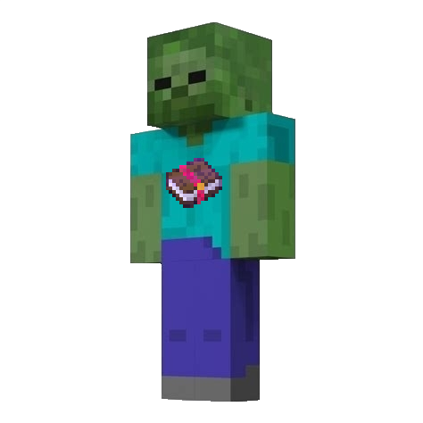

# Mob Specific Enchants fabric

#### Download Counts

### What is the purpose of this Mod?
This mod adds several enchants with mob specific features!

### Features
* Bane Of Illagers Enchant
  * Does 3 times damage to Illagers and Villagers, 2.5 times damage to Zombie Villagers 
* Bane of Bacon enchant
  * Does 3 times damage to Pig based mobs, 2.5 times to Zombified Piglins
* Bane of Enders Enchant
  * Does 3 times damage to all End based mobs
* Cube Slicer Enchant
  * Does 2.5 times damage to Slime and Magma cubes
* Wither Waster Enchant
  * Does 3.2 times damage to Withers and Wither Skeleton
  * Can only be obtained from trading and treasure
* Fly Swatter
  * Does 2.5 times damage to flying mobs
* Icy Edge
  * Applies Slowness to mobs. (Will eventually be updated to actually do freezing) 
  * Applies both Slowness and Weakness to nether mobs, because cold bad to them 🥶
  * Does more damage to Nether mobs, again, because cold bad. The extra damage is the level of enchantment you have (So 2 extra if you have icy edge 2)

### The Developers

| Author        | Role               | Links                                                                                              |
|:--------------|:-------------------|:---------------------------------------------------------------------------------------------------|
| NoComment1105 | Mod Lead           | [Contributions](https://github.com/NoComment1105/MobSpecificEnchants/commits?author=NoComment1105) |
| Bubblie01     | Assistant Mod Lead | [Contributions](https://github.com/NoComment1105/MobSpecificEnchants/commits?author=Bubblie01)     |

### Versioning
This mod is >= 1.17 at it's oldest. We are **NOT** going to back-port this mod to any older versions.\
We will try our hardest to updates this mod, in its latest release at the time, within a week the next Minecraft version

</a>

----

### Issues
If you have discovered an issue with our mod, please do not hesitate to ask anything in the [Discord](https://discord.gg/28N2Eeq2tT) or leave an issue in my [issue tracker](https://www.github.com/NoComment1105/MobSpecificEnchants/issues) but please check for a duplicate of your issue first, thanks :)

### License
Mob Specific Enchants is licensed under GNU LGPLv3, which is a free and open-source license. If you want to know more, poke
your nose in the [license file](https://github.com/NoComment1105/MobSpecificEnchants/blob/1.18/dev/LICENSE)
